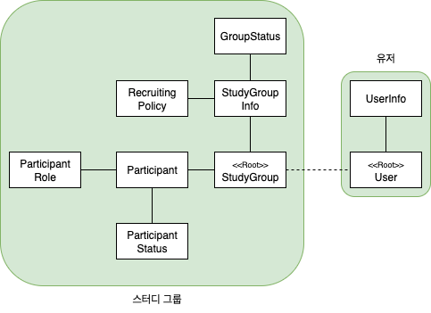

## 요구사항
### 사용자 기능
- 사용자는 회원가입을 할 수 있다.
- 사용자는 로그인을 할 수 있다.

### 스터디 그룹 생성/조회
- 사용자는 자유롭게 스터디 그룹을 생성할 수 있다.
  - 제목, 설명, 모집 인원, 모집 마감일, 모집 방식(자동/승인제)을 입력해야한다.
  - 생성 시 상태는 "모집중"으로 초기 설정된다.
- 사용자는 전체 스터디 그룹 중 "모집중" 상태인 그룹을 조회할 수 있다.
- 모집 마감일이 지나면 스터디 그룹 상태가 "진행중"으로 변경된다.

### 참여 신청/관리
- 사용자는 "모집중"인 스터디 그룹에 참여 신청할 수 있다.
  - 자동 승인 그룹일 경우 신청 시 즉시 승인된다.
  - 승인제 그룹일 경우 "대기중" 상태로 신청된다.
- 사용자는 자신이 신청한 참여 요청을 취소할 수 있다.
- 참여 승인된 사용자는 스터디 그룹에서 탈퇴할 수 있다.

### 방장 권한
- 스터디 그룹의 방장은 다음 권한을 가진다:
  - "대기중"인 참여자를 승인 또는 거절할 수 있다.
  - "승인됨" 상태인 참여자를 강퇴할 수 있다.
  - 모집 상태를 진행중으로 전환할 수 있다.
  - 진행중인 스터디를 종료할 수 있다.

### 상태 흐름
- 스터디 그룹 상태
  - 모집중 -> 진행중 -> 종료 (방장의 수동 전환)
- 참여자 상태
  - 없음 -> 대기중 -> 승인됨/거절됨
  - 없음 -> 대기중 -> 취소함
  - 승인됨 -> 탈퇴됨/강퇴됨

### 도메인 객체 도출 및 역할/책임 나누기
- User
  - 역할: 서비스 사용자
  - 책임:
    - 로그인, 회원가입
    - 내 정보 조회
- StudyGroup
  - 역할: 스터디 그룹의 핵심 도메인
  - 책임: 
    - 상태 전이 (모집중 -> 진행중 -> 종료)
    - 모집 조건 설정 (인원수, 마감일, 모집 방식)
    - 참여자 목록 관리
  - 협력: Host, Participant
- Host
  - 역할: 스터디 방장
  - 책임:
    - 참여 신청 승인/거절
    - 참여자 강퇴
    - 상태 전환 권한 (진행중, 종료)
  - 협력: StudyGroup
- Participant
  - 역할: 스터디 참여자
  - 책임:
    - 참여 신청/취소
    - 탈퇴
    - 자신의 참여 상태 전이
  - 협력: StudyGroup
  
### 도메인 모델 다이어그램

